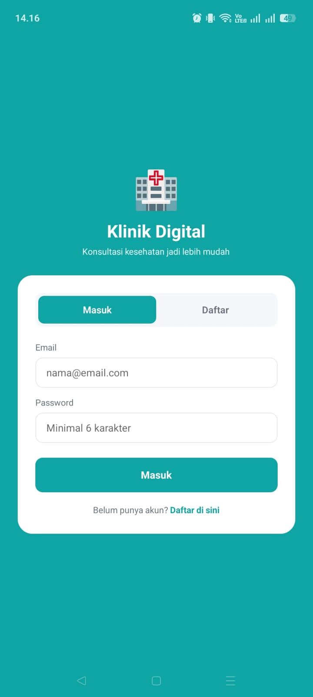
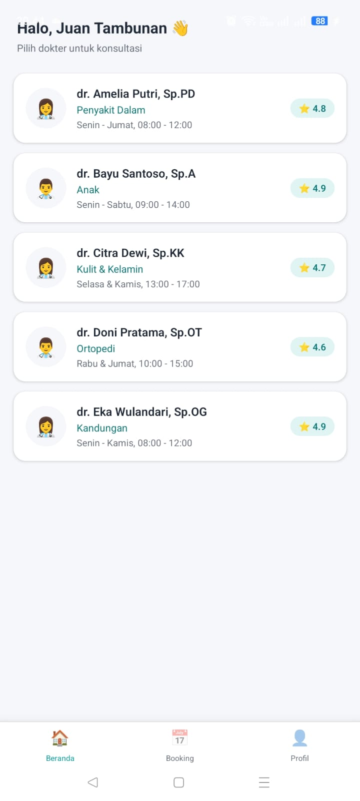
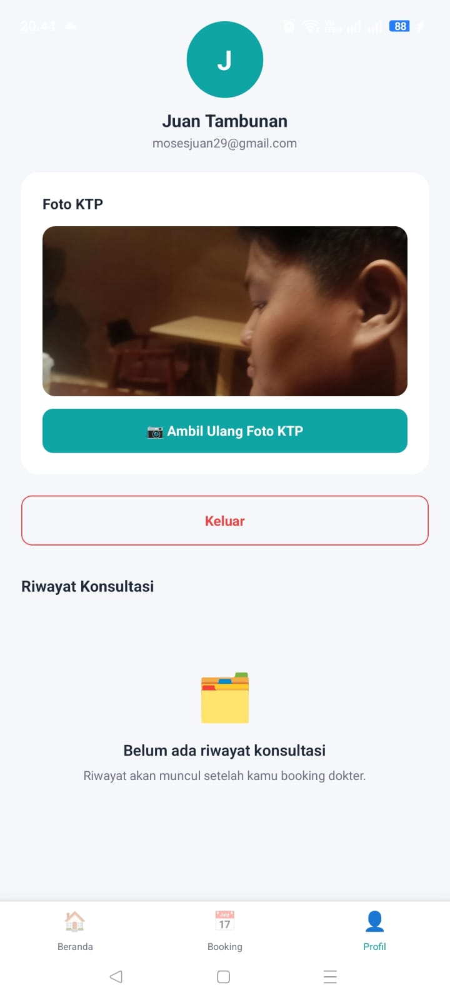

# Klinik Digital — Domain: Klinik Digital


> Klinik Digital adalah aplikasi manajemen klinik sederhana yang memudahkan pasien untuk melihat daftar dokter, melakukan booking konsultasi, dan menyimpan riwayat kunjungan secara lokal di perangkat. Aplikasi ini dirancang untuk pasien yang ingin mengatur jadwal konsultasi kesehatan tanpa perlu datang langsung ke klinik untuk sekadar mendaftar.

---

## 📸 Screenshots

| Login Screen | Home Screen | Feature Screen |
|:---:|:---:|:---:|
|  |  |  |

---

## ✨ Fitur Utama

- [x] Login/Register dengan validasi form (email format, password minimal 6 karakter, konfirmasi password)
- [x] Daftar dokter dengan FlatList (data dummy via `services/api.js`)
- [x] Detail dokter dengan navigasi Stack + kirim parameter (`doctorId`)
- [x] Booking konsultasi dokter + riwayat booking aktif
- [x] Foto profil/KTP via expo-image-picker (kamera) dengan permission handling
- [x] Data persisten dengan AsyncStorage (session, users, riwayat konsultasi, foto profil)
- [x] Bottom Tab Navigation (Beranda, Booking, Profil) + Stack Navigator

---

## 🛠️ Tech Stack

| Layer | Teknologi |
|-------|-----------|
| Framework | React Native + Expo (SDK 54) |
| Navigation | React Navigation v6 (Stack + Bottom Tab) |
| Storage | @react-native-async-storage/async-storage |
| Device | expo-image-picker (kamera) |
| Build | EAS Build (Expo Application Services) |

---

## 🚀 Cara Menjalankan

```bash
git clone https://github.com/USERNAME_KAMU/NAMA_REPO_KAMU.git
cd NAMA_REPO_KAMU
npm install
npx expo start
```
Scan QR Code dengan Expo Go di HP.

---

## 📦 Download APK

[Download APK terbaru](LINK_APK_GITHUB_RELEASE_ATAU_DRIVE)

---

## 🌐 Expo Snack

[Buka di Expo Snack](LINK_EXPO_SNACK)

---

## 👤 Developer

**JUAN MOSES TAMBUNAN** | 243303621215 | 4 PAGI A
Universitas Prima Indonesia — Prodi Sistem Informasi
Mata Kuliah: Pemrograman Mobile (TI-MOBILE-01)
